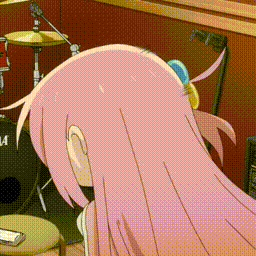

<b><a href="https://github.com/neovim/neovim">(Neo)Vimer</a></b>
•
<b><a href="https://krmmzs.blogspot.com/">My Blog</a></b>

### Hi there 👋

- 🌱 I’m currently learning CS
- 💬 May you could ask me about neovim or vim, I love them.

The most luxurious thing in the world is to be able to learn regardless of everything

